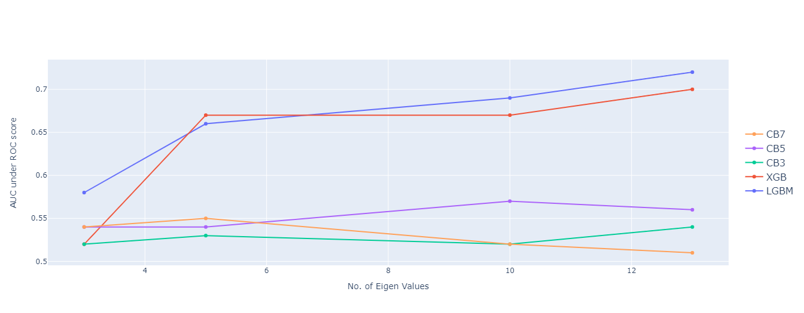

# Toxic Comment Classification using Machine Learning Algorithms
## Team Nan Prediction Pending
### CSE523 - Machine Learning, Ahmedabad University

## Introduction
Considering to moderate countless inappropriate or toxic comments on social media manually is a serious impractical approach. Thus, in our project, we implement this using and comparing various ML models. The data is downloaded from Kaggle[1], containing 1.5 million comments from wikipedia’s talk page and has to be implemented with multiclass-classification - toxic, obscene, identity hate, severe, etc. For the complete process till choosing the best model, we implement text vectorization, tf-idf calculations and basic use of linear algebra to get the reduced dimension of the vector form of out input. We then apply ML models like XGBoost, LGBM, CatBoost, etc. Models are tuned to give optimal test results. We infer that LGBM outperforms the other models. We would be discussing more about how we reached to this conclusion in later sections.

## Results
For various algorithms, results are generated in a graphical form. Please have a look at the [report](https://github.com/kairavishah2001/CSE523-Machine-Learning-2022-NaN-Prediction-Pending-/blob/main/Reports/Group13_NaN_Predicting_Pending_End_Sem_Project_Report%205.43.56%20PM.pdf).

### Fine Tuning

##### Here is the Graph of AUC verus number of eigen values for Gradient Boosting Models used in our project (CatBoost, XGBoost and LGBM)

### Results
#### Here is the table which states the AUC score for different eigen values and the amount of time taken by the model to get trained

## References

- “Toxic comment classification challenge,” Kaggle. [Online]. Available: https://www.kaggle.com/c/jigsaw-toxic-comment-classification- challenge/data. [Accessed: 20-Mar-2022]. 
- K. M. Lhaksmana, D. T. Murdiansyah, and N. S. Azzahra, “Toxic Comment Classification on SocialMedia Using Support Vector Machine and Chi Square Feature Selection,” View of toxic comment classification on social media using support Vector Machine and Chi Square feature selection. [Online]. Available: http://socj.telkomuniversity.ac.id/ojs/index.php/ijoict/article/view/ 552/316. [Accessed: 20-Mar-2022]. 
- G. Xiang, B. Fan, L. Wang, J. I. Hong, and C. P. Rose, Detecting Offensive Tweets via Topical Feature Discovery over a Large Scale Twitter Corpus. [Online]. Available: https://www.cs.cmu.edu/ lingwang/papers/sp250-xiang.pdf. [Accessed: 20-Mar-2022]. 
- Van Rossum G, Drake Jr FL. Python tutorial. Centrum voor Wiskunde en Informatica Amsterdam, The Netherlands; 1995. Available: https://www.python.org/ 
- Wickham H. ggplot2: Elegant Graphics for Data Analysis. Springer- Verlag New York. ISBN 978-3-319-24277-4, 2016. Available: https://ggplot2.tidyverse.org 
- R Core Team (2019). R: A language and environment for statistical¿ computing. R Foundation for Statistical Computing, Vienna, Austria.¿ Available: https://www.R-project.org/. 

